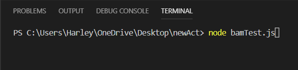
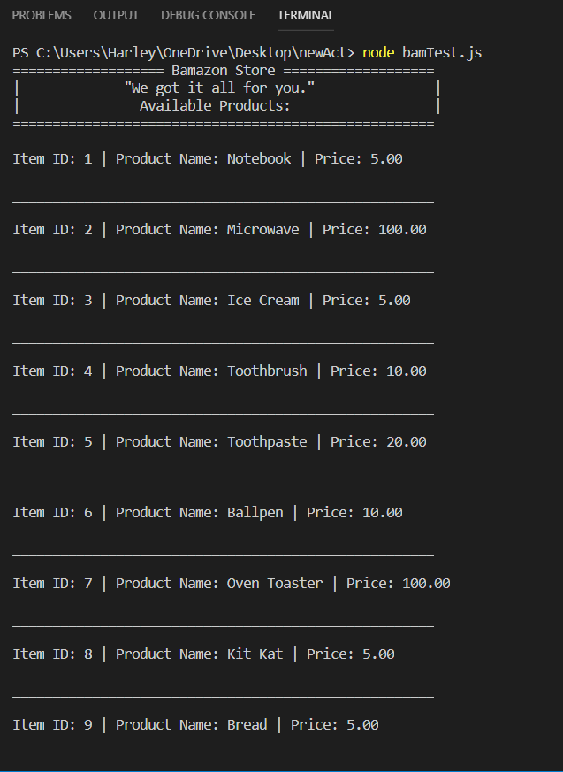
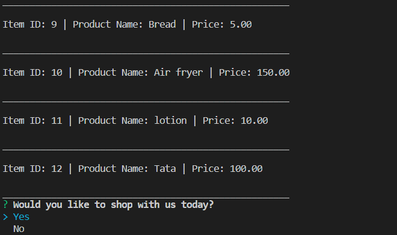
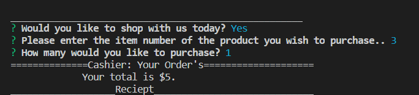

** BAMAZON HOMEWORK **

## In this homework we were TOLD to make a Amazon/ebay-like app, called, "Bamazon".

### *Here are some snippets, of how it works...*

### This is how you can Shop with Bamazon :

1. On your Terminal, Type: node liri.js and click enter :
this will give you options or lists on what command you wnat to shop for..
It will show all the available products..
and it will prompt some questions for you:

if user says No:

if user says Yes:

if everything is successful, it'll show a receipt of your purchase!

1. Low-inventory :

### hope you like this bamazon app!
